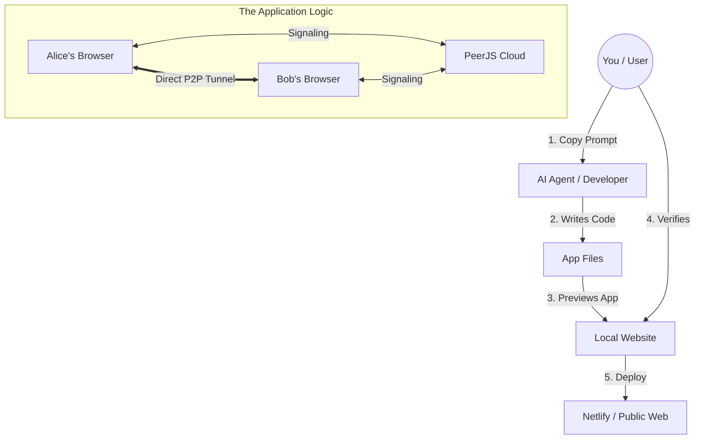

# Definitive Guide: How to Replicate This P2P App with AI

**Goal:** Create a serverless, persistent, Peer-to-Peer chat application.
**Tools Required:** Any AI Coding Agent (Cursor, Windsurf, Bolt, etc.) or ChatGPT/Claude.
**Skill Level:** Zero (Copy & Paste).

---

## 1. The Orchestration Diagram
This diagram explains how the "AI Building Process" works. You act as the **Project Manager**, and the AI acts as the **Developer**.

---

## 2. Step-by-Step "Meta-Prompts"
To recreate this project, simply **copy and paste** these prompts into your AI agent one by one.

### Phase 1: Setup & Core Structure
> **Prompt 1:**
> "Create a new React application using Vite.
> Install the 'peerjs' library.
> I want to build a Serverless P2P Chat application where two users can chat directly using WebRTC.
> Use 'App.jsx' for the main logic.
> Use standard CSS for styling.
> Please set up the basic project structure now."

### Phase 2: The UI & Design (Glassmorphism)
> **Prompt 2:**
> "I want the app to look premium and modern.
> Apply a 'Glassmorphism' style with a dark purple/blue gradient background.
> The UI should have 3 distinct screens:
> 1. **Setup Screen**: A simple input to set my Display Name.
> 2. **Dashboard**: Show my Peer ID (with a copy button) and an input to Connect to a Friend.
> 3. **Chat Screen**: A full-width chat interface with message bubbles (blue for me, gray for friend).
> Update 'App.jsx' and 'App.css' to implement this."

### Phase 3: The Logic (WebRTC & PeerJS)
> **Prompt 3:**
> "Now implement the PeerJS logic in 'App.jsx'.
> Requirements:
> 1. Initialize PeerJS when the user sets their name.
> 2. Show a 'My ID' string that I can share.
> 3. When I enter a friend's ID and click Connect, establish a data connection.
> 4. IMPORTANT: Wait for the connection 'open' event before showing the Chat Screen to avoid race conditions.
> 5. Add a timeout: If connection takes longer than 10 seconds, show a 'Timeout/Firewall' error.
> 6. Add these STUN servers to the Peer config to ensure it works over the internet: 'stun:stun.l.google.com:19302', 'stun:global.stun.twilio.com:3478'."

### Phase 4: Deployment Preparation
> **Prompt 4:**
> "I want to deploy this to Netlify.
> Please create a 'Deployment Guide' for me.
> Also ensure the 'vite.config.js' or 'package.json' allows the app to be built properly using 'npm run build'."

---

## 3. How to Deploy (Publishing)
Once the AI finishes Phase 4:

1.  **Push to GitHub**:
    *   Ask the AI: *"Initialize git and push this code to a new repository named p2p-chat."*
2.  **Connect to Netlify**:
    *   Go to **Netlify.com**, log in, and click **"Import from Git"**.
    *   Select your `p2p-chat` repo.
    *   Click **Deploy**.
3.  **Done!** You have your own permanent P2P chat app.
